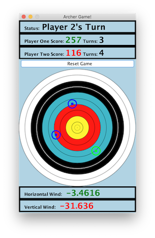

# 401 Hackathon Entry

This is my entry for UNC's 'Cirque de 401' Hackathon hosted on November 23, 2019.  

The theme of the hackathon was carnival games, so I recreated the classic archery game in Java Swing. This entry won the overall first place prize.  

The game allows two players to compete by giving them a total of five shots each. There is a wind component that alters the direction of the arrow shot which makes the game more difficult. There is also a reset button so more than one game can be played.   

